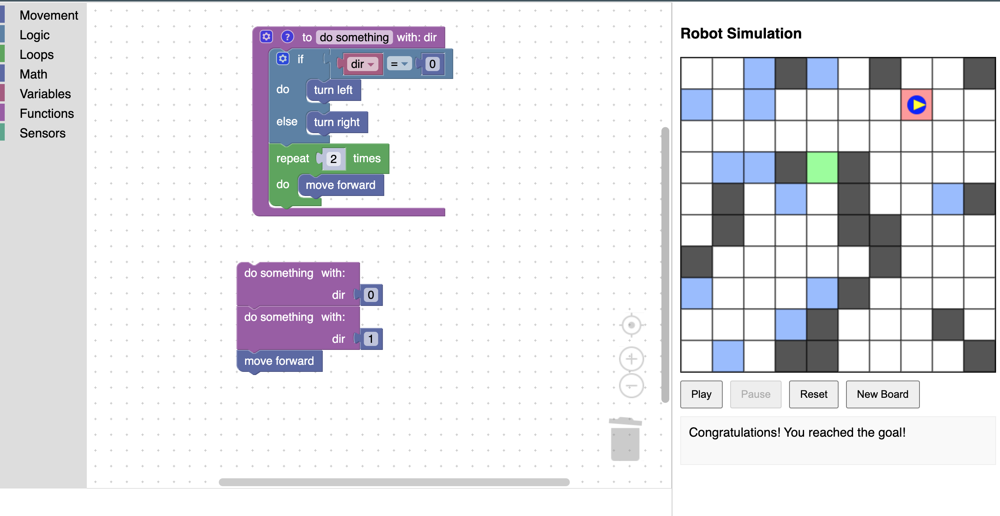
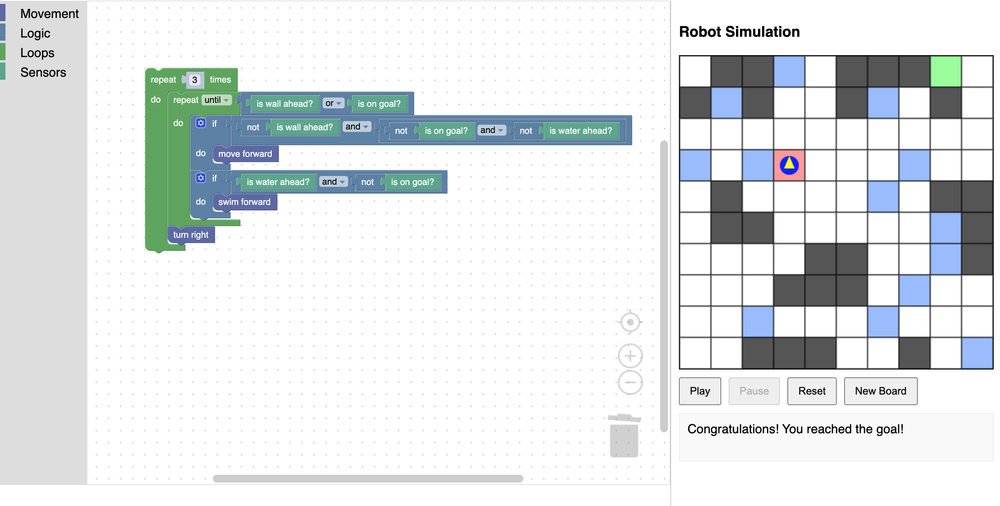

# Program a robot using Blockly to build the program

https://antonrd.github.io/web-games-collection/program-the-robot/

For some time I had this idea to create a simple HTML page for young people learning to code. The page would allow them ot use Blockly blocks to construct a program, which is used to control a robot moving on a fields of square cells. It has always been a very low priority project and I never found the time for it. But nowadays when AI models can generate the code for such projects, I decided to give it a go. With a few iterations, the code that does something meaningful was ready. This required no coding on my side, just prompting AI models, looking for solutions to errors and reading the model explanations.

Used Google AI Studio with Gemini 2.5 Pro Preview 05-06 to generate the source code for a spec that is described in the spec.txt file. It also contains follow-up requirements and a few comments about what happened while iterating on the code with Gemini.

# How it looks

To give a basic idea of how the UI can be used below are two screenshots of programs constructed using Blockly blocks.





## Issues while generating the code

### Old Blockly library API expectations

The model generated code initially, which was causing a JS error. The problem seems to be that earlier versions of Blockly worked with code like that:

```js
  Blockly.JavaScript['robot_move_forward'] = function(block) {
    return 'await robotAPI.moveForward();\n';
  };
```

but with the latest version this leads to an error: `Uncaught (in promise) Error: JavaScript generator does not know how to generate code for block type "robot_move_forward".`

Initially Gemini could not suggest a fix, so I checked with ChatGPT, which initially also suggested a number of other possible issues, until it finally pointed out the real problem - that the code needs to be written as follows:

```js
  javascriptGenerator = Blockly.JavaScript;

  // Other code may be found here...

  javascriptGenerator.forBlock['robot_move_forward'] = function(block) {
    return 'await robotAPI.moveForward();\n';
  };
```

### Expectations that Blockly would detect async JS code inside user-defined functions

Gemini explicitly expressed its reliance on the ability of Blockly to make the JS code for user-defined functions blocks be using async functions. But this does not seem to be the case with the version of Blockly used. Another prompt was needed to ask Gemini to generate code, which can handle that.

## Follow up question to Gemini

Finally, asked Gemini the following question: "given this game, is it possible to write a program for the robot, which guarantees that the final goal cell will always be reached regardless of the board?"

Its answer goes like that:

Even with the addition of functions, variables, conditional logic (if/else), and loops, the answer is still fundamentally no, it is not possible to write a single, fixed Blockly program that guarantees the robot will always reach the goal cell regardless of the randomly generated board, given the current set of commands and sensors.

Here's why the limitations persist, even with these new programming constructs:

Lack of True Maze-Solving Primitives / Global State Awareness:

No Memory of Visited Cells: The core problem remains. The robot cannot inherently remember "I've been to cell (x,y) before." Variables can store simple counts or flags, but not a complex 2D map of visited locations.

No Backtracking Mechanism: While functions can structure code, there's no built-in Blockly mechanism (or simple way to construct one with current blocks) for true, systematic backtracking like in Depth-First Search (DFS). A DFS would require a stack to keep track of paths and the ability to "undo" moves when a dead end is hit and all options from a junction are exhausted.

No Global Map View: The robot still only perceives its immediate surroundings (wall ahead, water ahead, on goal). It cannot "see" the entire maze layout to plan an optimal (or even any) path from a global perspective.

Complexity of Arbitrary Mazes:

Randomly generated mazes can be arbitrarily complex, featuring long winding paths, large empty areas that look like traps (but aren't), islands, and sophisticated dead ends.

Simple strategies (even those using variables and functions) will eventually be defeated by a sufficiently complex maze structure if they don't incorporate a robust maze-solving algorithm's principles.

What can users do with variables and functions?

Implement More Sophisticated Local Strategies:

Use a variable to count steps and change behavior after a certain number (e.g., "try going straight for 5 steps, then try turning").

Use a flag variable to remember a recent state (e.g., "was the last turn a right turn?").

Create functions for common sequences like "check_all_directions_and_move_if_clear" or "navigate_around_obstacle."

Attempt Basic Wall Following (with limitations):

Users can try to implement a basic wall-following algorithm (e.g., "always keep a wall to your right"). Functions can help structure this.

However, simple wall followers can get stuck in certain types of mazes (e.g., those with detached "islands" where the start and goal are on different sides of a loop that the wall follower gets trapped in). Variables might help detect some simple loops (e.g., if back at start facing same direction after N steps), but not all.

Improve Code Readability and Reusability: This is a major benefit, but doesn't inherently grant maze-solving superpowers.

Why True Maze-Solving Algorithms are Hard with Current Blocks:

Consider Trémaux's algorithm, a human-usable maze-solving method that guarantees a solution:

Mark every path you take (e.g., once when entering, twice when exiting).

At a junction, never take a path marked twice.

If you hit a dead end or a junction where all paths are marked twice, turn around and go back the way you came (marking it twice as you exit).

If at a junction with an unmarked path, take it (marking it once).

If at a junction with paths marked once, take one of those (marking it twice).

Blockly limitations for Trémaux's:

Marking Paths: How does the robot "mark" a cell or path in the currentGrid? The robotAPI doesn't allow modifying the grid. Even if it did, users can't directly access/modify a 2D array from Blockly.

Storing Path History for Backtracking: How does it remember the exact path taken to systematically backtrack? Variables are insufficient for this complex state.

Conclusion:

While variables and functions make the programming environment much more powerful and allow for more complex user-devised strategies, they don't provide the fundamental building blocks for a general-purpose maze-solving algorithm that can handle any arbitrary, solvable maze generated by your system.

The robot still operates on local information without a persistent, comprehensive memory of the maze structure or a built-in way to implement algorithms like DFS or BFS that require such memory. Users can write clever programs that solve many types of mazes, but a universal solver is out of reach with the current blockset.
